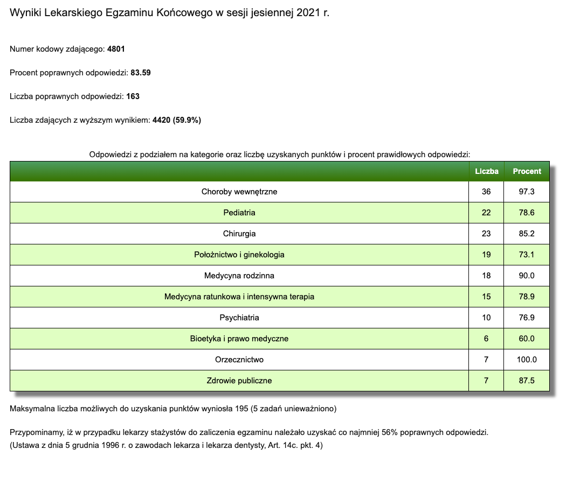

# lek
Przygotowanie do egzaminu LEK. 

Data egzaminu: 18 września 2021

Wyniki:

Uzyskałem 83,6% => świetny wynik jak na pierwsze podejście 😇

Mapy myśli:

1. [Choroby wewnętrzne](./mapy/1.interna) (ukończone)
2. [Pediatria](./mapy/2.pediatria) (ukończone)
3. [Chirurgia](./mapy/3.chirurgia) (ukończone)
4. [Ginekologia](./mapy/4.ginekologia) (ukończone)
5. [Psychiatria](./mapy/5.psychiatria) (ukończone)
6. [Medycyna ratunkowa](./mapy/6.ratunkowa) (ukończone)
7. [Prawo medyczne](./mapy/7.prawo) (ukończone)
8. [Medycyna rodzinna](./mapy/8.rodzinna) (ukończone)

9 września 2021 — KURS UKOŃCZONY!
