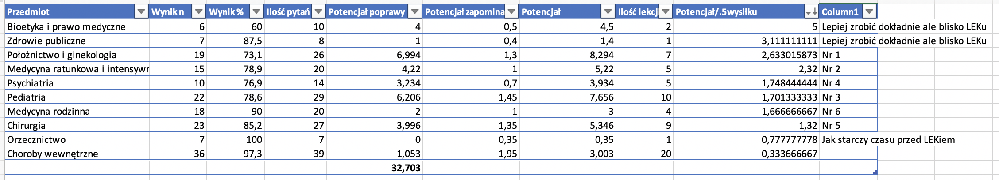

# Lek 2°

Drugie podejście do LEK — 19 lutego 2022.

Kolejność nauki: 

Reasumując nauka po kolei:

1. Położnictwo i ginekologia (7 lekcji)
2. Medycyna ratunkowa (5 lekcji)
3. Pediatria (10 lekcji)
4. Psychiatria (5 lekcji)
5. Chirurgia (9 lekcji)
6. Medycyna rodzinna (4 lekcje)
7. Przed samym lekiem dokładnie: Bioetyka, prawo, zdrowie publiczne, orzecznictwo (5 lekcji)

Choroby wewnętrzne tylko poprzez pytania powtarzam. Czyli mam lekcji do nauki: 45.

# Lek 1°

Przygotowanie do egzaminu LEK. 

Data egzaminu: 18 września 2021

Wyniki:

Uzyskałem 83,6% => świetny wynik jak na pierwsze podejście 😇

Mapy myśli:

1. [Choroby wewnętrzne](./mapy/1.interna) (ukończone)
2. [Pediatria](./mapy/2.pediatria) (ukończone)
3. [Chirurgia](./mapy/3.chirurgia) (ukończone)
4. [Ginekologia](./mapy/4.ginekologia) (ukończone)
5. [Psychiatria](./mapy/5.psychiatria) (ukończone)
6. [Medycyna ratunkowa](./mapy/6.ratunkowa) (ukończone)
7. [Prawo medyczne](./mapy/7.prawo) (ukończone)
8. [Medycyna rodzinna](./mapy/8.rodzinna) (ukończone)

9 września 2021 — KURS UKOŃCZONY!
